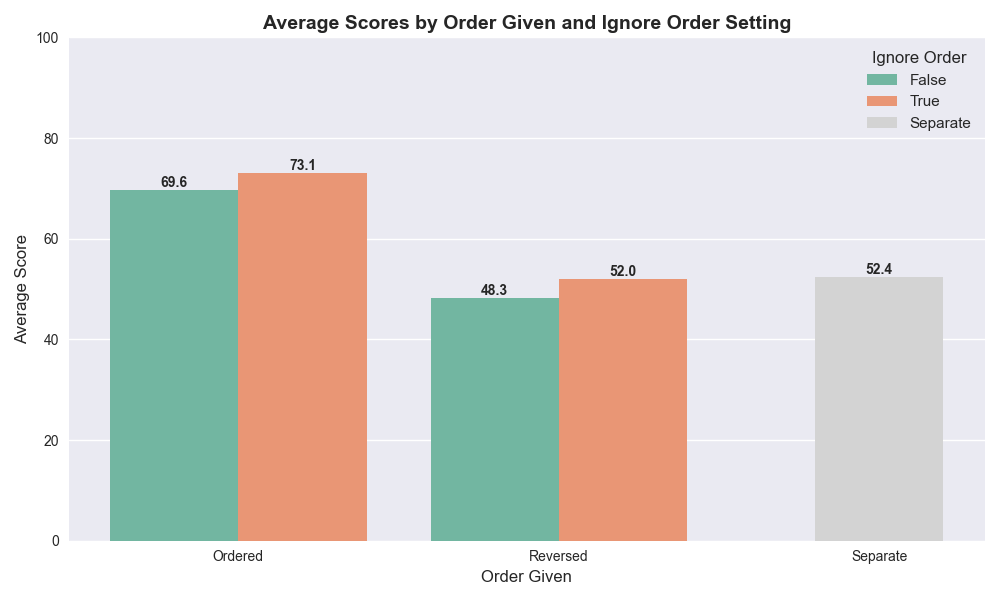

# Stack Overflow LLM-as-a-Judge

Using LLM's to judge information is popular these days, especially in areas of big data where it would be costly and impractical to have human evaluators. This has led many discoveries, mostly to the tune of 'they're not as good at judging as humans'; whether through positional, self-favouring, or other biases, as well as issues with it's 'reasoning'. This is probably to be expected, but nevertheless, there have been many attempts to reduce this gap in evaluation quality, and there are numerous ways people have sought to do this.

With this project, I will evaluate some of these methods, analysing their effect on the quality of an LLM's judging capabilities. 

In setting out to do this, I searched for some kind of database with already-evaluated data in it, which I could then compare to the LLM's evaluations. Of course this isn't always an easy thing to find, and this led me to think of Stack Overflow; a forum where questions are asked and answered by a community, and then ranked by their merit and relevance to the question asked. Due to this ranked nature, I realised this is a great opportunity to test an LLM-as-a-judge system.

### How To Run

Add your watsonx api key (or replace with other LLM provider).
Run stack_agent.py. This will query the LLM for all question IDs in the questionID array and populate a 'test_results.csv' file
Run graphing.py. This will display the data from the test results on a bar chart.

### My Method

 - First, I selected questions from the site on various different topics, and grouped them as such.
 - I then extracted and formatted the question and the top 5 answers (if there were 5 answers available)
 - Here is where I tried two different approaches.
 - First, I tried giving the LLM the question and all 5 answers (identified by their author's user id), and asked it to give the answers a ranking, based on it's merit and relevance to the question. This would often return surprisingly accurate results when compared to the actual upvotes ranking on the site. I then tried giving it the answers in a reverse order (5-4-3-2-1), and saw a sharp drop off in accuracy. I soon realised that this original accuracy was due to a positional bias - the LLM would favour the earlier answers with higher scores, assuming they were better.
 - I then tried comparing the accuracy of the LLM when given a prompt which specified the answers were in **no particular order**, with its accuracy without.
 - My next thought was to eliminate the positional bias completely, by making seperate calls to the LLM for each answer, passing in the question each time. This of course was slower and more token-intensive, but allowed me to evaluate the LLM's capabilities much more fairly.
 - I also wanted to test whether it would be better at answering questions which were asked before its training cut-off, which would tell me a) that it had been trained on stack overflow data, and b) that it could 'recall' this information to help it evaluate answers.

### My Findings

It was difficult to test these methods against as many questions as I'd have liked, due to the slow nature of each query (especially the seperate answers). I ended up with a question bank of 35. Below are one set of results I collected (They would vary each time I ran it for obvious reasons).

There are 3 interesting findings from this figure I'd point out, though due to the differences in each run, I plan to get an average of a few runs in order to obtain an more accurate dataset.
    1. Telling the LLM to ignore the order of the answers given to it **increased** the accuracy of it's rankings, regardless of the order they were given in. This sometimes wasn't true for the ordered group, but
    was **always** the case for the Reversed group; clearly showing the positional bias the LLM gave towards the earlier elements.
    2. As an extension of the above, we can see that regardless of the prompt, the LLM's accuracy was **considerably** higher when given the answers in order of Stack Overflow ranking, showing how strong the 
    positional bias is to rank the earlier given ones higher, despite being told there is no correlation.
    3. Lastly, although we can see here that the Separate querying type was *just* more accurate than the Reversed type, there was a lot of variation in how well the separate type performed, suggesting that
    either there isn't a strong enough correlation between an answer and how many upvotes it does, or an LLM isn't good at determining this. I suspect a mixture, especially as I didn't consider the date at which an answer was given, as that can have a strong effect on how well an answer does, and the LLM isn't given this information.

### Conclusion

Clearly there are strong positional biases from modern LLMs (as found by many researchers recently), and separating the queries to be per-answer allowed me to remove that, but I still ran into the problem 
that there is not necessarily a correlation between how *good* an answer is, and how many upvotes it has to a question, or at least not one that is easily found. To improve this research, I would try running 
the tests multiple times to get an average of the responses, but I also would consider changing the inputs to be something with a clearer correlation between quality and ranking (or vetting the questions myself 
to test this).

## Prompts used:

**Base Prompt:**
I will give you a stack overflow question, and some answers to it, given by different authors. \
I want you to return a score for each owner's answer, giving them all in the JSON format specified.

**Ignore Order Prompt:**
I will give you a stack overflow question, and some answers for it. The answers are in **NO PARTICULAR ORDER **. \
I want you to return a score for each owner's answer, giving them all in the JSON format specified. Do not show any bias towards the order in which they are currently given.

**Separate answers prompt:**
I will give you a question asked on stack overflow, and an answer which was given for it. You will evaluate the answer (give it a score out of 100) for each of 4 attributes: 
    1. Accuracy - How correct the answer is with its technical accuracy 
    2. Relevance - How well the answer actually tackles the question given 
    3. Clarity - How clear the author is in expressing their answer/solution in terms which may be easily understood by the questioner 
    4. Conciseness - Is the question thorough but avoiding unnecessary verbosity? 
With each of these answers, ground them in **what the questioner would find most useful** (i.e. which answer would likely get the most votes on stack overflow).
A dictionary will be returned, with each attribute as a key, and each score (/100) as the value for that key.